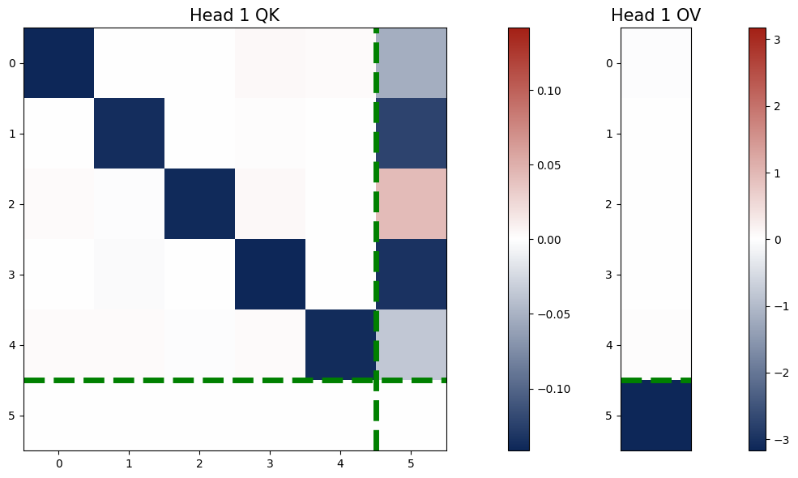
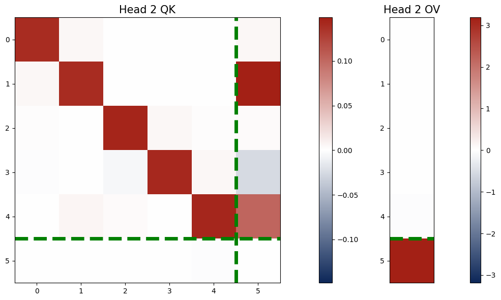
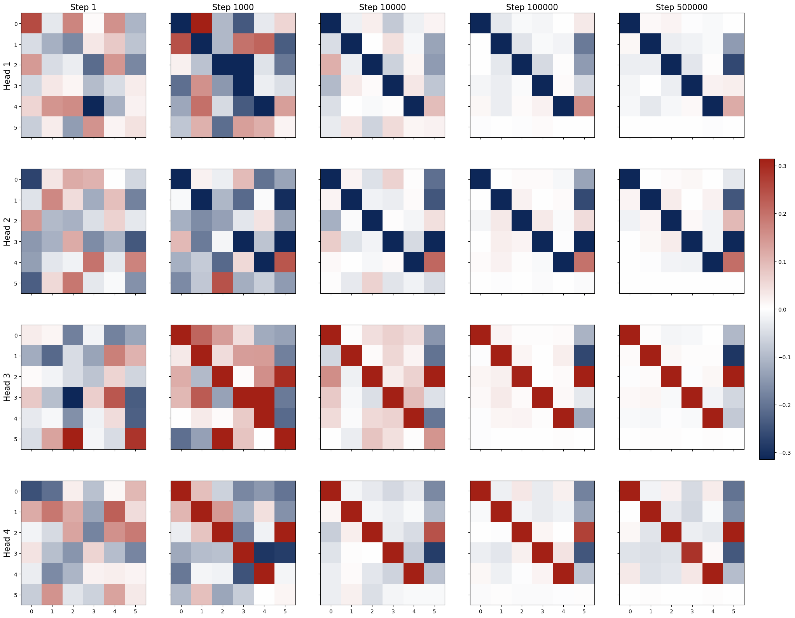
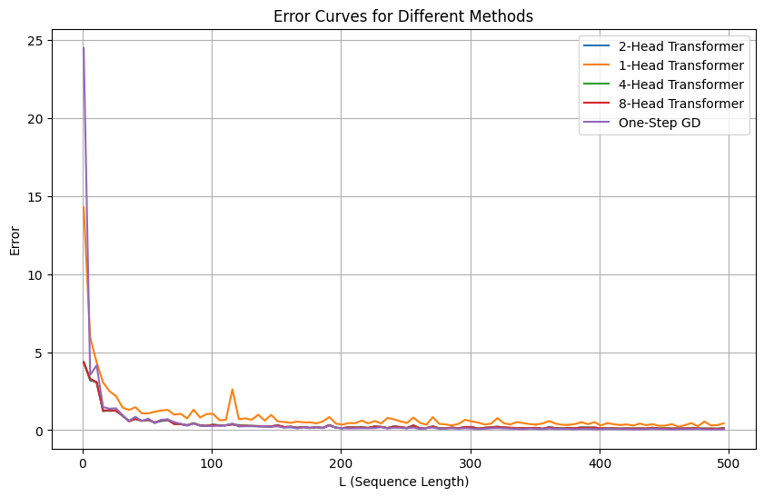

# Biography

I'm a third year undergraduate student from [Kuang Yaming Honors School](https://dii.nju.edu.cn/), [Nanjing University](https://www.nju.edu.cn/).
My research interest includes Machine Learning, Deep Learning. Specially, I focus on Mechanistic Interpretability: to reverse engineer neural network, especially Transformer which is widely used in LLMs. 

Here's my [CV](http://xintianpan.github.io/files/Curriculum_Vitae.pdf). If you have the same research interest, feel free to contact me!

# Research

## In Context Linear Regression For Transformer Model (Ongoing)
**Authors**: _**Xintian Pan**_, _Jianliang He_, _Siyu Chen_, _Zhuoran Yang_.

**Background**: Transformers have been 

**Contribution**: This work makes the following contributions:
<figure style="text-align: center;">
  

    

    

  

  <figcaption style="text-align: center;">
    <b>Figure 1:</b> QK And OV Circuits Learned by Transformer with 2 Heads.
  </figcaption>
</figure>

1. **One-layer** Transformer learns kernel regressor algorithm by training
2. **One-layer** Transformer with **2 softmax attention heads** learns **paired QK and OV circuits**
3. When eigenvalues of the paired QK circuits are **small**, the output is close to the **one-step GD estimator**.
4. **One-layer** Transformer with **more than 2 softmax attention heads** is equivalent to a one-layer Transformer with **2** heads
5. **Multi-Head** SoftMax Attention **outperforms** one-head SoftMax Attention.

<figure style="text-align: center; width: 100%;">
  
  <figcaption style="text-align: center; margin-top: 10px;">
    <b>Figure 2:</b> Evolution of QK Circuits during Training for Transformer with 4 Heads.
  </figcaption>
</figure>

<figure style="text-align: center;">
  

    

  

  <figcaption style="text-align: center; margin-top: 10px;">
    <b>Figure 3:</b> Error Curve of Different Models Comparing with One-Step GD Estimator. Head = 1 Case is worse than any other cases.
  </figcaption>
</figure>

**Demo**: Here's the demo for the ongoing research [Demo](https://xintianpan.github.io/demos/demo.html).
